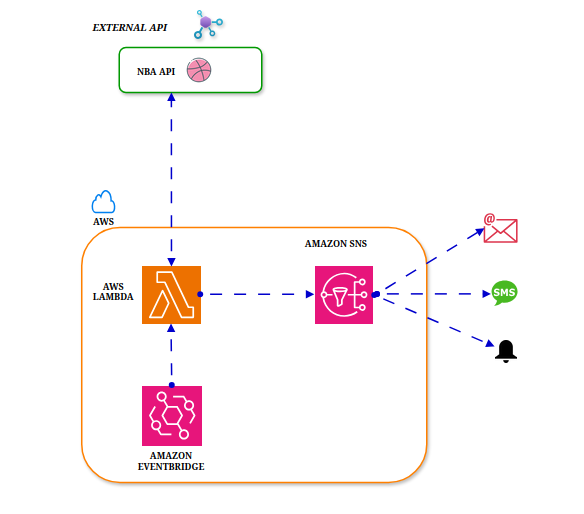

# NBA GAME DAY NOTIFICATION SYSTEM

Day 2 of the 30 days of DevOps challenge . 

## PROJECT OVERVIEW

This application  is a game notification/alert system  that sends out NBA games score notifications at real time to subscibers via email or SMS. The applications uses some AWS services and NBA API to provide subscribers up-to-date information about NBA games.

## Project Services/Technology 
This project uses the following services 
- AWS Lambda: Executes the backend logic to  retrive the data from the NBA API and publishing  notifications to the SNS topic.
- Amazon SNS: Sends notifications to subscribers via email or SMS.
- Amazon EvenBridge: Schedules notifications at specified intervals to invoke the lambda function.
- NBA APIs : Contains  real-time NBA game scores and updates.

## Project Prerequisites
 
Before starting this  project, make sure you have and know  the following:

 1. An **AWS Account**: Create an AWS account if you haven't done so already using this link, https://signin.aws.amazon.com/signup?request_type=register
 2. A **GitHub Account**: You will need a GitHub account to store your project code and track changes. 
3 An **SPOTSDATA API Key**: Register on sportsdataio to get your API key. https://sportsdata.io/user/register
4. A **Basic understanding of Python**: You will need some basic knowledge of python programming  

## Project Architecture

The architecture involves:

AWS Lambda as the backend processor.

Amazon SNS for distributing notifications.

Amazon EventBridge for triggering Lambda functions on a schedule.

NBA API integration to fetch game scores.

## Steps to Create/Build and and run the App. 

### Create an SNS topic

1. Open the AWS Management Console.
2. Navigate to the SNS service.
3. Click Create Topic and select Standard as the topic type.
4. Name the topic (e.g., gd_topic) and note the ARN.
5. Click Create Topic.

### Add Subscriptions to the SNS Topic

1. After creating the topic, click on the topic name from the list.
2. Navigate to the Subscriptions tab and click Create subscription.
3. Select a Protocol:

    * For Email:
        Choose Email.
        Enter a valid email address.
    * For SMS (phone number):
        Choose SMS.
        Enter a valid phone number in international format (e.g., +1234567890).

4.Click Create Subscription.
5. If you added an Email subscription:
    * Check the inbox of the provided email address.
    * Confirm the subscription by clicking the confirmation link in the email.

6. For SMS, the subscription will be immediately active after creation.

### Create the SNS Publish Policy

1. Open the IAM service in the AWS Management Console.
2. Navigate to Policies → Create Policy.
3.Click JSON and paste the JSON policy from gd_sns_policy.json file
4.Replace REGION and ACCOUNT_ID with your AWS region and account ID.
5.Click Next: Tags (you can skip adding tags).
6.Click Next: Review.
7.Enter a name for the policy (e.g., gd_sns_policy).
8.Review and click Create Policy.

### Create a lambda function

1. Open the IAM service in the AWS Management Console.
2. Click Roles → Create Role.
3. Select AWS Service and choose Lambda.
4.Attach the following policies:
    * SNS Publish Policy (gd_sns_policy) (created in the previous step).
    * Lambda Basic Execution Role (AWSLambdaBasicExecutionRole) (an AWS managed policy).

5. Click Next: Tags (you can skip adding tags).
6. Click Next: Review.
7. Enter a name for the role (e.g., gd_role).
8. Review and click Create Role.
 9.Copy and save the ARN of the role for use in the Lambda function

### Deploy the Lambda Function

1. Open the AWS Management Console and navigate to the Lambda service.
2. Click Create Function.
3. Select Author from Scratch.
4. Enter a function name (e.g., gd_notifications).
5. Choose Python 3.x as the runtime.
6. Assign the IAM role created earlier (gd_role) to the function.
7. Under the Function Code section:
    Copy the content of the src/gd_notifications.py file from the repository.
    Paste it into the inline code editor.

8. Under the Environment Variables section, add the following:

    NBA_API_KEY: your NBA API key.
    SNS_TOPIC_ARN: the ARN of the SNS topic created earlier.

9.Click Create Function.

### Create an Event Bridge rule.

1. Navigate to the Eventbridge service in the AWS Management Console.
2. Go to Rules → Create Rule.
3. Select Event Source: Schedule.
4. Set the cron schedule for when you want updates (e.g., hourly).
5. Under Targets, select the Lambda function (gd_notifications) and save the rule.

## Troubleshooting
Common Issues and Solutions

### 1. Email/SMS Notifications Not Received:

    Ensure the email address or phone number is subscribed to the SNS topic.

    Verify email confirmation was completed.

    Check your spam folder for the email confirmation link.

### 2 Invalid API Key Error:

    Verify that the NBA API key is correctly set in the Lambda environment variables.

    Confirm your SportsData.io account is active and the API key is valid.

### 3 Lambda Execution Errors:

    Check the Lambda execution logs in Amazon CloudWatch for detailed error messages.

    Ensure the IAM role assigned to Lambda has the necessary permissions.

### 4. EventBridge Rule Not Triggering:

    Verify the cron expression used in the EventBridge rule.

    Ensure the rule is enabled.

### 5. SNS Policy Errors:

    Confirm that the gd_sns_policy has the correct ARN and permissions.

    Update the IAM policy to match the required permissions.

### 6. High Latency or Delayed Notifications:

    Test the SNS topic with minimal subscribers to identify performance bottlenecks.

    Optimize the Lambda function code for better efficiency.